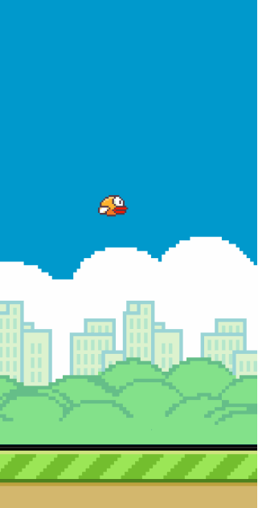

# Game Animation
Flappy Bird demo, practice of ES6 new features `class`

## How to run this

1. clone this repo to local
2. open game.html in browser
3. press `W` to make bird jump

## Demo

## TODO
1. collision checking
2. score system
3. bird status, alive or dead